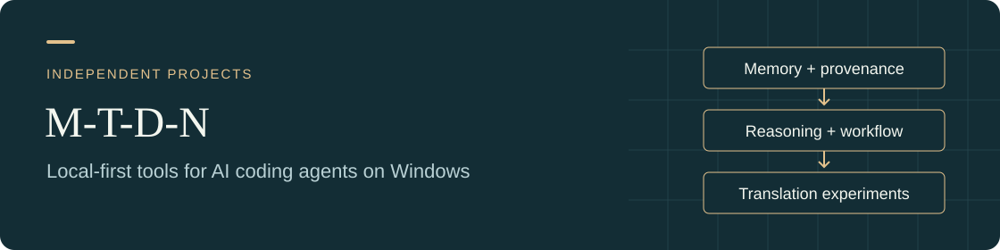

# M-T-D-N

  

**Local-first tools for AI coding agents on Windows.**

Windows에서 AI 코딩 에이전트와 함께 쓰는 도구와 작업 방식을 만들고 공유합니다.

[Memory](https://github.com/M-T-D-N/agentmemory-codex-windows) · [Reasoning control](https://github.com/M-T-D-N/codex-ares-windows) · [Workflow skills](https://github.com/M-T-D-N/codex-workflow-skills) · [Translation](https://github.com/M-T-D-N/koharu-hy-qwen-pipeline)

## Find your starting point

| If you want to… | Explore | What to expect |
|---|---|---|
| Carry useful context across Codex tasks | [AgentMemory for Codex on Windows](https://github.com/M-T-D-N/agentmemory-codex-windows) | Independent Windows technical preview with managed hooks and source-labelled recall |
| Adjust reasoning effort during a task | [Codex Ares for Windows](https://github.com/M-T-D-N/codex-ares-windows) | Source preview to build locally; Luna evaluates the next generation for your selected Main model |
| Improve how an agent approaches work | [Codex Workflow Skills](https://github.com/M-T-D-N/codex-workflow-skills) | Nine skills, installed individually |
| Explore a local manga translation pipeline | [Koharu HY–Qwen Pipeline](https://github.com/M-T-D-N/koharu-hy-qwen-pipeline) | Japanese-to-Korean experiment requiring CUDA and an operator-supplied Qwen runtime |

## Projects

### AgentMemory for Codex on Windows

An independent Windows-native AgentMemory downstream for OpenAI Codex Desktop and Codex CLI.

Managed lifecycle hooks capture eligible conversation turns; exact-project writes and source-labelled federated recall keep context tied to its provenance. Optional loopback-only local graph extraction supports the Windows profile.

[Repository](https://github.com/M-T-D-N/agentmemory-codex-windows) · [Releases](https://github.com/M-T-D-N/agentmemory-codex-windows/releases) · [Installation guide](https://github.com/M-T-D-N/agentmemory-codex-windows/blob/main/packaging/windows-codex/npm/README.md) · [한국어](https://github.com/M-T-D-N/agentmemory-codex-windows/blob/main/READMEs/README.ko-KR.md) · [日本語](https://github.com/M-T-D-N/agentmemory-codex-windows/blob/main/READMEs/README.ja-JP.md)

### Codex Ares for Windows

Choose your Main model and let an independent Luna evaluator select the reasoning effort for its next generation. Astra, Sol and Sol 6.1 routes continue within the same conversation.

This is source to build locally. The repository distinguishes existing local runtime validation from checks of the public source layout and reports the limits of its workload comparisons.

[Repository](https://github.com/M-T-D-N/codex-ares-windows) · [Build guide](https://github.com/M-T-D-N/codex-ares-windows/blob/main/docs/build.md) · [Pilot results](https://github.com/M-T-D-N/codex-ares-windows/blob/main/docs/pilot-results.md) · [한국어](https://github.com/M-T-D-N/codex-ares-windows/blob/main/README.ko.md) · [日本語](https://github.com/M-T-D-N/codex-ares-windows/blob/main/README.ja.md) · [简体中文](https://github.com/M-T-D-N/codex-ares-windows/blob/main/README.zh-CN.md)

### Codex Workflow Skills

Nine independently installable skills for grounded changes, evidence-driven debugging, lean execution, bounded delegation, critical review, task handoff, and visual prompt reconstruction.

필요한 스킬만 골라 설치할 수 있습니다. 각 스킬의 적용 범위와 도구 의존성은 저장소에 안내되어 있습니다.

[Browse the skills](https://github.com/M-T-D-N/codex-workflow-skills#스킬-선택) · [Installation](https://github.com/M-T-D-N/codex-workflow-skills#설치) · [Swarm](https://github.com/M-T-D-N/codex-workflow-skills/blob/main/skills/swarm/SKILL.md)

### Koharu HY–Qwen Pipeline

An independent Japanese-to-Korean manga translation experiment, with a pinned headless API/MCP patch for Koharu. Hy-MT2 produces a first pass, Qwen reviews it, and the launcher exposes remaining translation decisions for review.

Model weights, manga pages and private evaluation output are outside the public source repository. The Qwen runtime and lifecycle integration are supplied by the operator.

[Repository](https://github.com/M-T-D-N/koharu-hy-qwen-pipeline) · [Setup](https://github.com/M-T-D-N/koharu-hy-qwen-pipeline#prepare-koharu) · [Requirements](https://github.com/M-T-D-N/koharu-hy-qwen-pipeline#requirements) · [Upstream Koharu](https://github.com/mayocream/koharu)

## Community resources

[awesome-mcp-servers](https://github.com/M-T-D-N/awesome-mcp-servers) is a fork used for a curated-list contribution. The original list is maintained by [punkpeye and contributors](https://github.com/punkpeye/awesome-mcp-servers).

## Why I build these tools

Native Windows users should be able to operate persistent agent memory with explicit project boundaries, visible provenance, and a managed Codex workflow. The workflow skills share practical ways to carry that work from a clear request through implementation and verification.

## Scope and validation

For AgentMemory, most downstream changes were generated and revised with OpenAI Codex from my requirements. I tested the supported Windows/Codex workflow. I have not manually reviewed every source file, and no independent audit has been performed. Detailed validation evidence, limitations, and upstream attribution are documented in the repository.

Each project's README describes its own scope, AI assistance, and validation limits.
